mermaid_test.md 
      #Mermaid 실습
 

 #mermaid 실습
 -순서도 실습

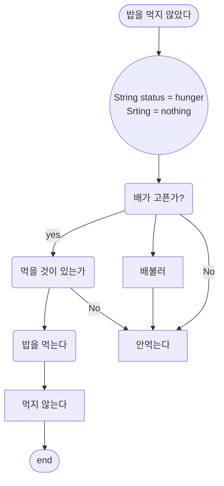


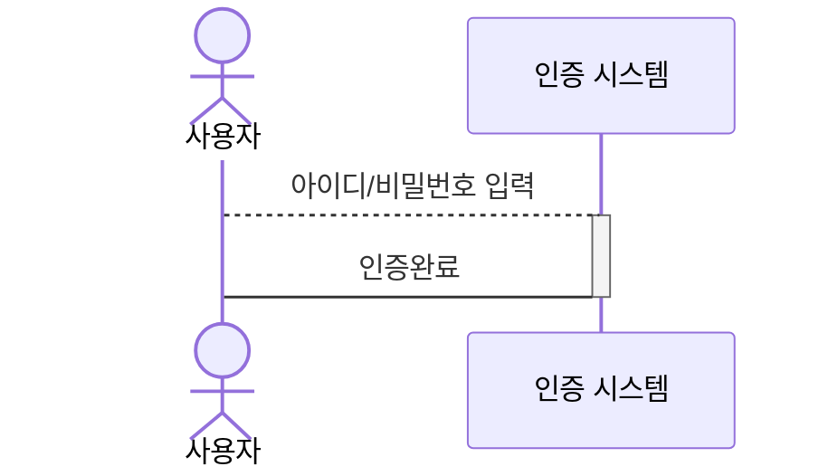

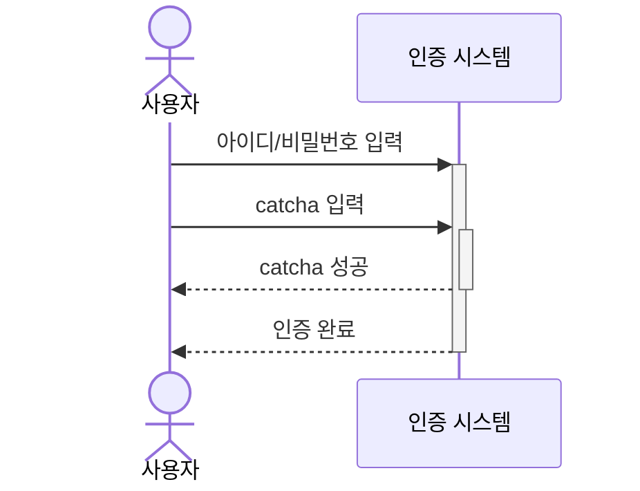

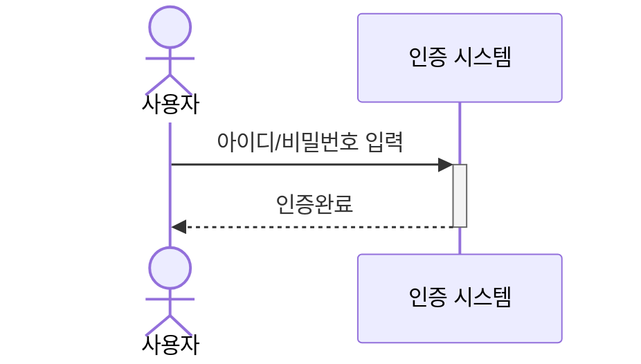

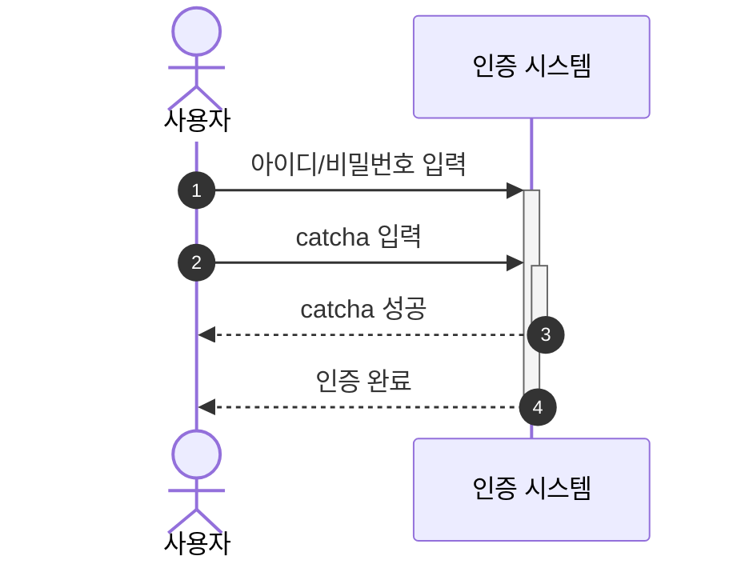

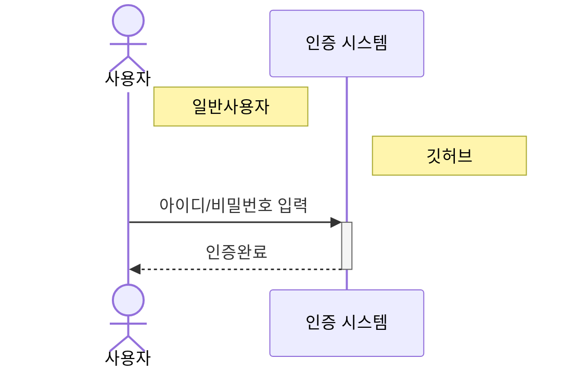

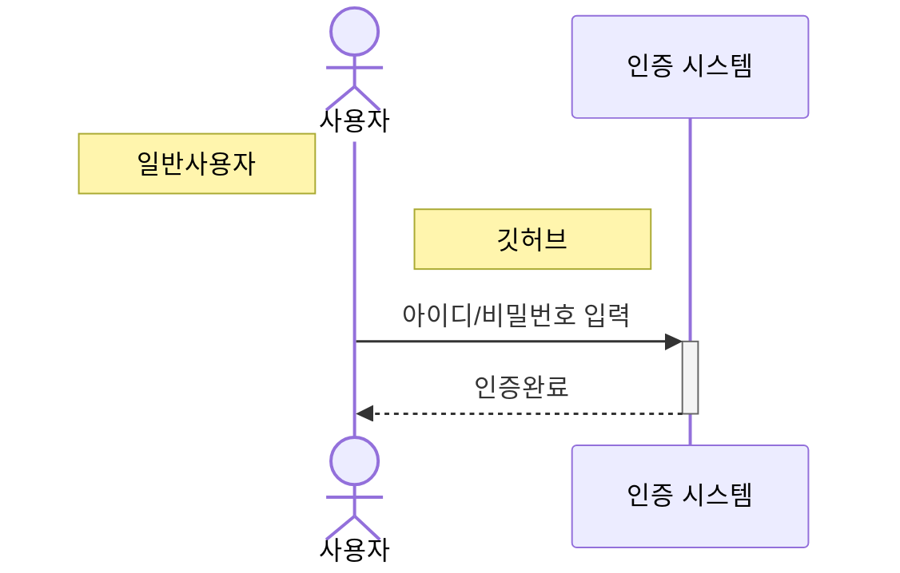

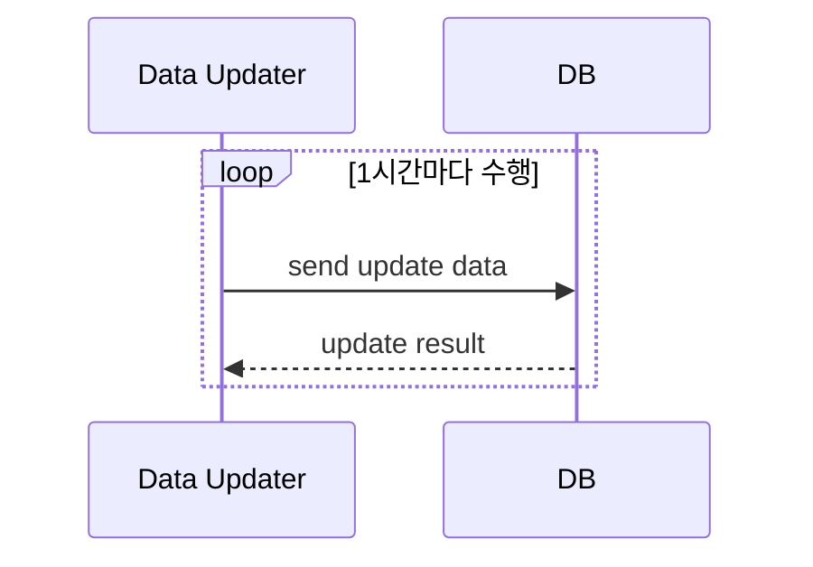

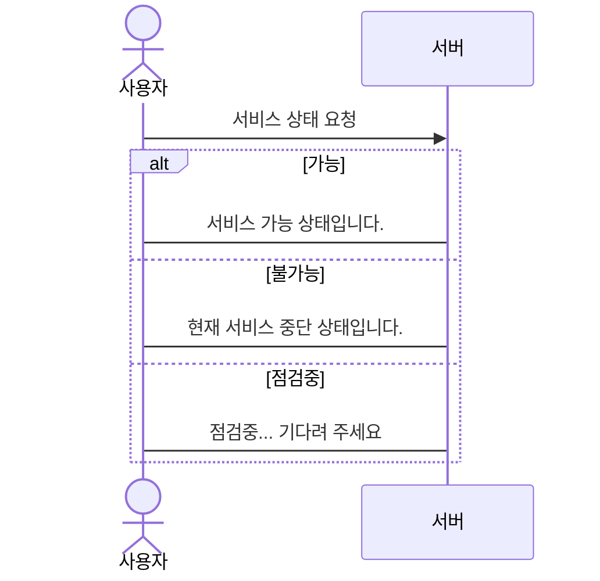

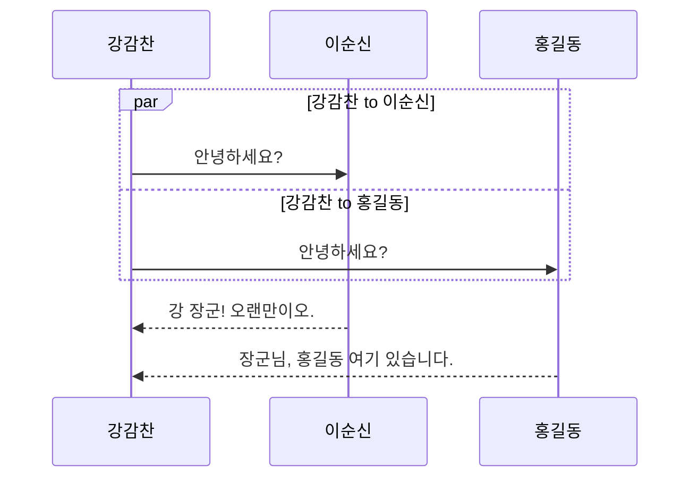

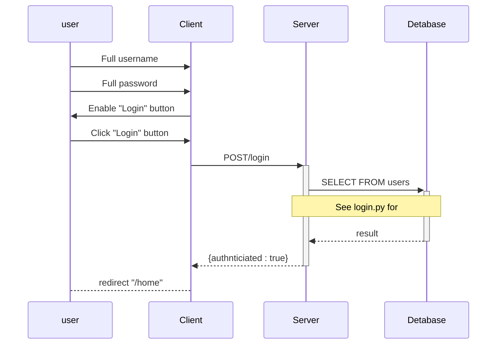

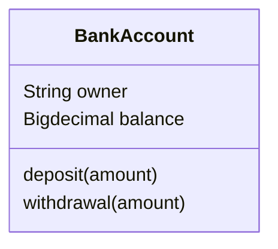

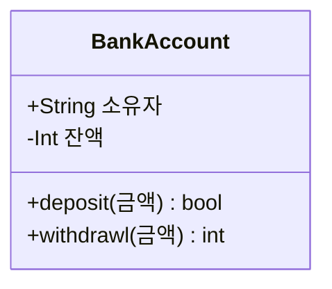
```{mermaid}
classDiagram
    classA <|-- classB
    classC *-- classD
    classE o-- classF
    classG <-- classH
    classI <.. classJ
    classK <|.. classL
    classM -- classN
    classO .. classP
```

```{mermaid}
classDiagram
    Customer "1" --> "*" Ticket
    Student "1" --> "1..*" Course
    우주 --> "many" star : Contains
```

```{mermaid}
classDiagram
  direction LR

  class 학생 {
    -학생증: 학생증
  }
  class 학생증 {
    -id : int
    -name : string
  }
  class 자전거 {
    -id : int
    -name : string
  }
  학생 "1" --o "1" 학생증 : 가지고다닌다
  학생 "1" --o "1" 자전거 : 탄다
```


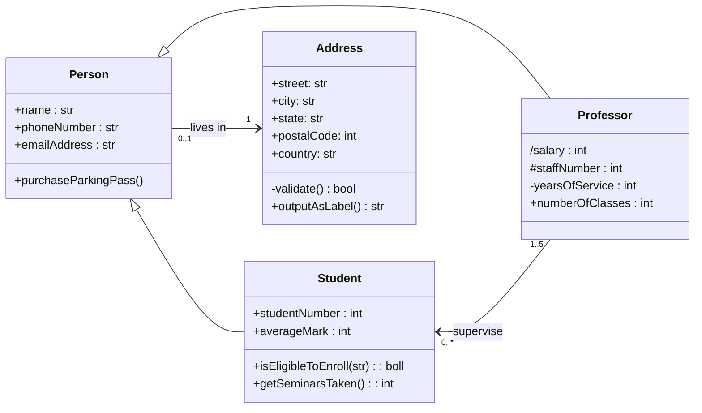